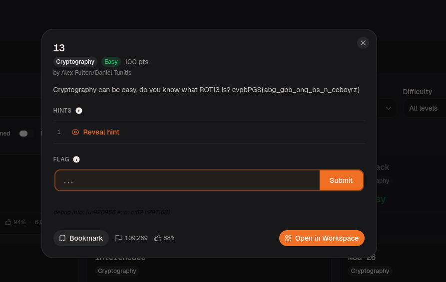
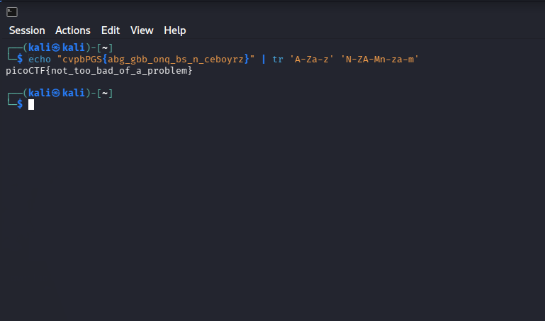
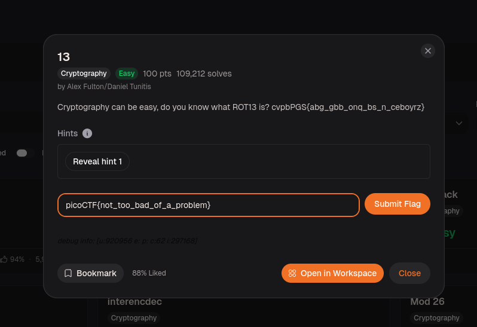

# 13 – picoCTF Write-up
 
## Challenge Overview
 
A ciphertext was given with the hint: *"Cryptography can be easy, do you know what ROT13 is?"*
The goal was to decode the string and recover the flag.
 
This challenge used **ROT13** — a Caesar cipher with a fixed shift of 13. Because the alphabet has 26 letters, applying ROT13 twice returns the original text, meaning encryption and decryption are the exact same operation.
 
```
cvpbPGS{abg_gbb_onq_bs_n_ceboyrz}
```
 

 
---
 
## Vulnerability Analysis
 
ROT13 has no real cryptographic security:
 
1. **No key** — the shift is always 13, universally known.
2. **Single operation** — applying it once decrypts any ROT13-encoded string. There is nothing to brute force.
The decryption is straightforward:
 
```
each letter → shifted 13 positions back in the alphabet
non-letter characters ({}_ etc.) → unchanged

```
 
\---
 
## Step 1 — Identifying the Encoding
 
The challenge title and description both say ROT13 directly, so no identification step was needed here. In a real scenario, scrambled-looking English text where letter frequency looks close to normal English is usually a giveaway for a small Caesar shift.
 
---
 
## Step 2 — Decoding in the Terminal
 
Used the `tr` command on Kali to apply ROT13:
 
```bash
echo "cvpbPGS{abg_gbb_onq_bs_n_ceboyrz}" | tr 'A-Za-z' 'N-ZA-Mn-za-m'
```
 

 
---
 
## Step 3 — Flag
 
```
picoCTF{not_too_bad_of_a_problem}
```
 

 
---
 
## Notes
 
The `tr 'A-Za-z' 'N-ZA-Mn-za-m'` one-liner handles both uppercase and lowercase in one shot and is faster than going to an online decoder. ROT13 was originally used on forums to hide spoilers — it has no place in real encryption, but shows up constantly in beginner CTFs.
 
