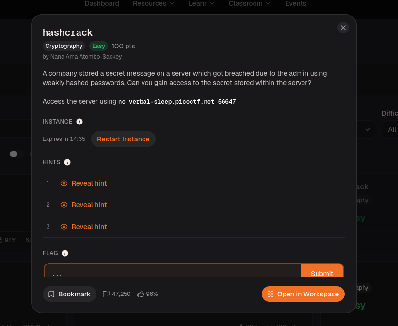
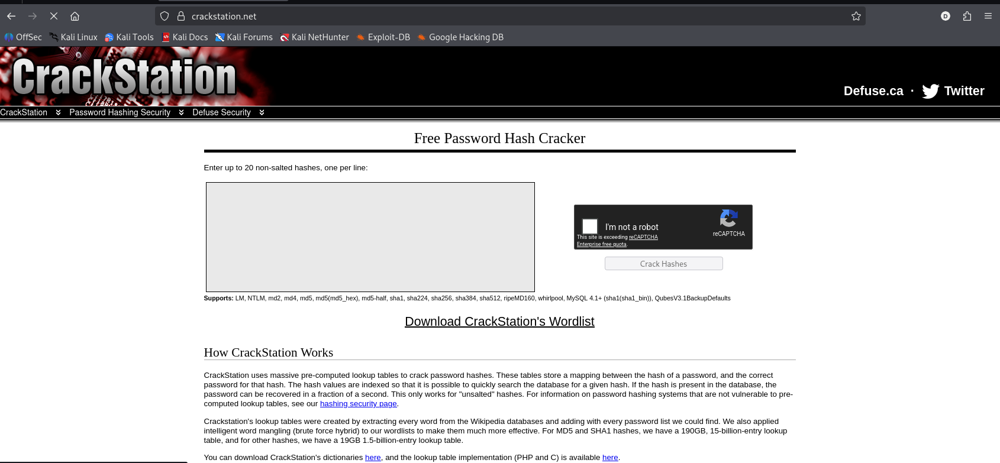
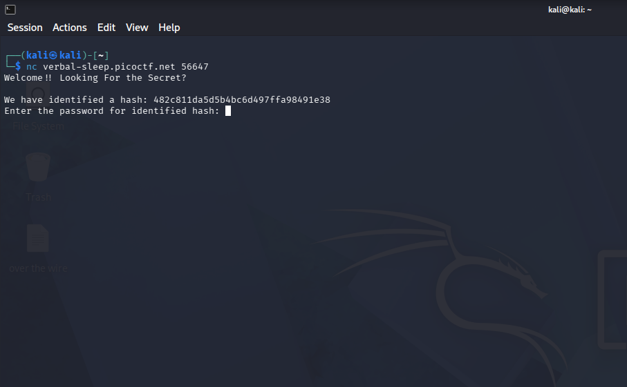
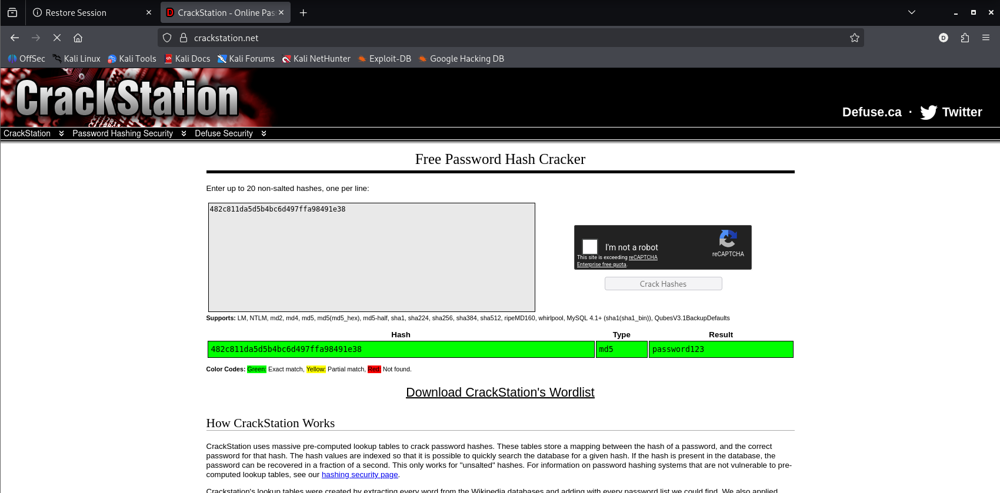
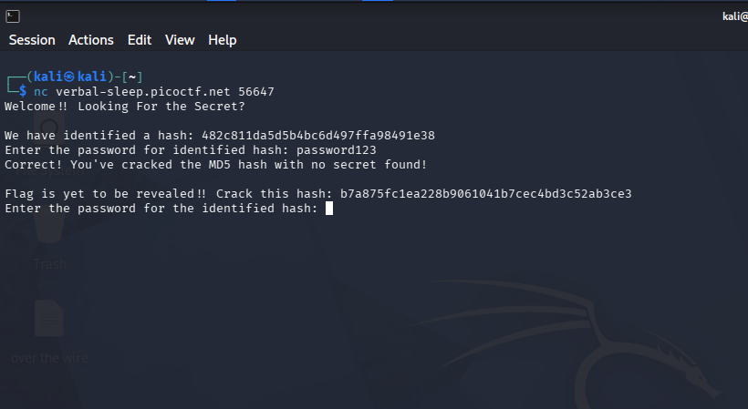
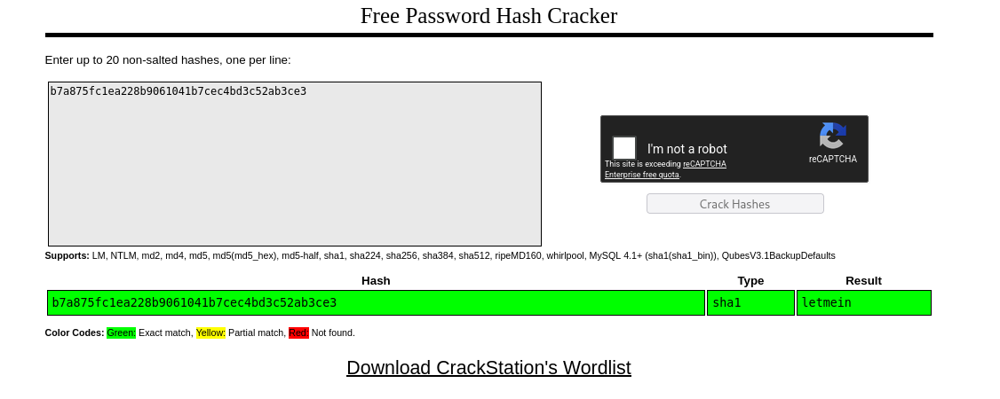
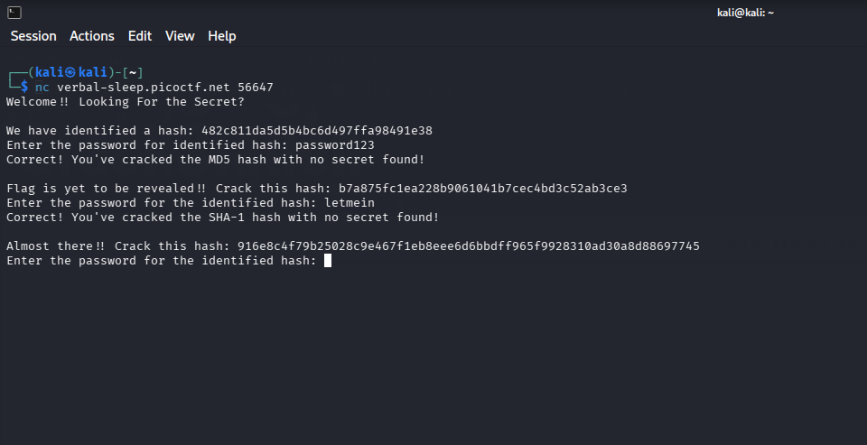
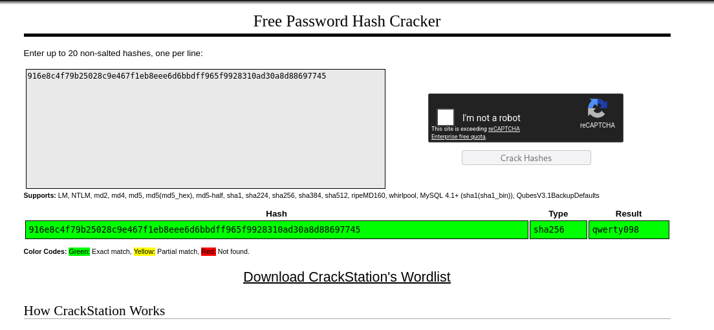
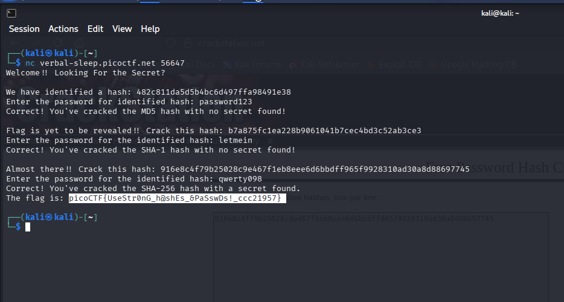
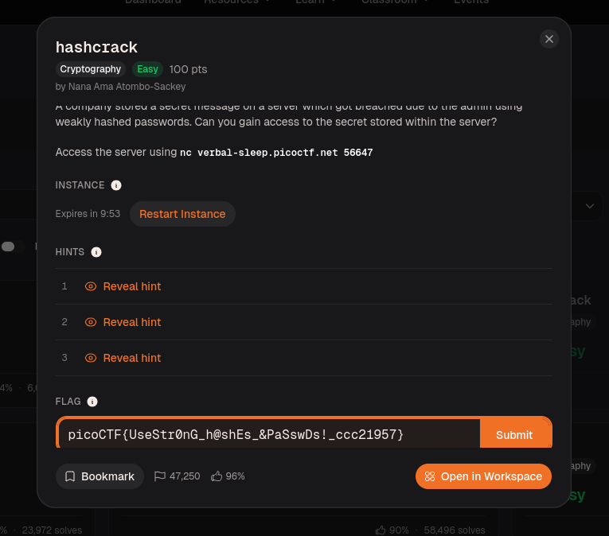

# hashcrack – picoCTF Write-up

## Challenge Overview

A company stored a secret message on a server which got breached because the admin used weakly hashed passwords. The goal was to connect to the server, crack three hashes in sequence, and recover the hidden flag.

This challenge involved identifying and cracking **MD5**, **SHA-1**, and **SHA-256** hashes. All three passwords were common wordlist entries, making them trivially lookable.

```bash
nc verbal-sleep.picoctf.net 56647
```



---

## Vulnerability Analysis

Three weaknesses made this straightforward:

1. **Weak hashing algorithms** — MD5 and SHA-1 are cryptographically broken for password storage. SHA-256 is stronger but still vulnerable without salting.
2. **No salt** — none of the hashes were salted, meaning precomputed lookup tables work directly against them.
3. **Common passwords** — all three plaintexts (`password123`, `letmein`, `qwerty098`) appear in every standard wordlist.

---

## Important: Hashes Are One-Way Functions

Before getting into the steps — hashes are **not** like Base64 or other encodings. You cannot reverse them using CyberChef or any decoder because hashing is a one-way function. There is no "decrypt" button. Once something is hashed, the original input is mathematically unrecoverable through the hash alone.

What you *can* do in CyberChef is identify what *type* of hash it is based on length and format — but that's as far as it goes.

To actually crack a hash, you need one of two approaches:
- **Brute force / wordlist attack** — hash every word in a dictionary and compare
- **Rainbow table lookup** — use a precomputed database of hash→plaintext pairs

For this challenge I used **CrackStation** — a website that maintains a massive precomputed lookup table built from Wikipedia dumps, password lists, and wordlist mutations. If a password is weak and common, it's almost certainly already in there. You paste the hash, it searches the table, and returns the plaintext instantly.



---

## Step 1 — Connecting to the Server

```bash
nc verbal-sleep.picoctf.net 56647
```

The server gives you one hash at a time and asks for the matching plaintext before moving to the next.



---

## Step 2 — Cracking the Hashes

**Quick identification by length:**

| Hex characters | Algorithm |
|----------------|-----------|
| 32             | MD5       |
| 40             | SHA-1     |
| 64             | SHA-256   |

---

**Round 1 — MD5**

```
482c811da5d5b4bc6d497ffa98491e38
```

32 characters → MD5. Pasted into CrackStation — came back instantly.

```
Result: password123
```



Entered it into the server — correct. It then gave the next hash.



---

**Round 2 — SHA-1**

```
b7a875fc1ea228b9061041b7cec4bd3c52ab3ce3
```

40 characters → SHA-1. Same process.

```
Result: letmein
```



Entered it — correct. Final hash appeared.



---

**Round 3 — SHA-256**

```
916e8c4f79b25028c9e467f1eb8eee6d6bbdff965f9928310ad30a8d88697745
```

64 characters → SHA-256. This one had the flag behind it.

```
Result: qwerty098
```



---

## Step 3 — Flag Revealed

Entered `qwerty098` and the server printed the flag.



---

## Flag

```
picoCTF{UseStr0nG_h@shEs_&PaSswDs!_ccc21957}
```



---

## Notes

Real password storage needs **bcrypt**, **scrypt**, or **Argon2** with proper salting — not raw MD5, SHA-1, or SHA-256. Salting means even if two users have the same password, their hashes are different, and precomputed rainbow tables become useless.

The flag spells it out: `UseStr0nG_h@shEs_&PaSswDs!`

**Tools used:** `nc`, [CrackStation](https://crackstation.net), Kali Linux
