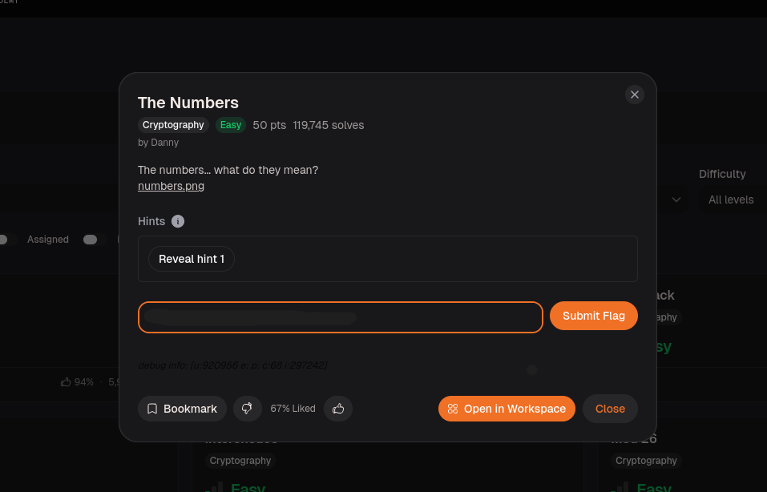
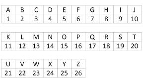
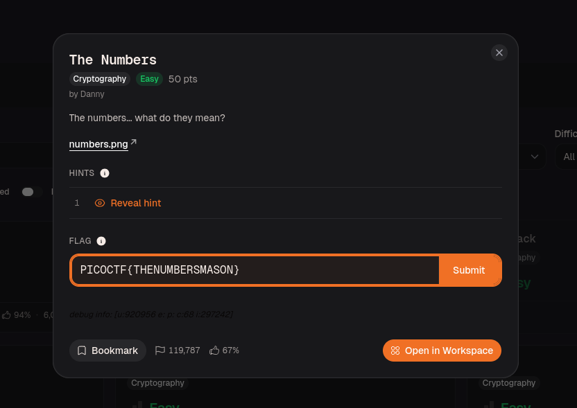

# The Numbers – picoCTF Write-up
 
## Challenge Overview
 
A PNG file was given with the hint: *"The numbers... what do they mean?"*
The goal was to decode a sequence of numbers into readable text to recover the flag.
 
This challenge used **A1Z26 encoding** — a simple scheme where each number maps directly to its corresponding letter in the alphabet (A=1, B=2 ... Z=26). No key, no cipher, just positional mapping.
 

 
---
 
## Vulnerability Analysis
 
The encoding has no cryptographic strength whatsoever:
 
1. **Fixed, keyless mapping** — A1Z26 is always the same. Anyone who recognizes it can decode it instantly.
2. **No obfuscation** — the numbers in the image are plaintext, just presented visually instead of as a string.
Once you identify the scheme, the "decryption" is:

 
```
number → letter position in alphabet
16 → P, 9 → I, 3 → C, 15 → O ...
```
 
---
 
## Step 1 — Opening the File
 
Downloaded `numbers.png` and opened it. The image contained a sequence of numbers.
 

 
---
 
## Step 2 — Decoding A1Z26
 
Mapped each number to its letter:


 
 
```
16  9  3  15  3  20  6  {  20  8  5  14  21  13  2  5  18  19  13  1  19  15  14  }
P   I  C   O  C   T  F     T   H  E   N   U   M  B  E   R   S   M  A   S   O   N
```
 
The `{}` and any non-alphabetic characters pass through unchanged — only numbers 1–26 get converted.
 
---
 
## Step 3 — Flag
 
```
PICOCTF{THENUMBERSMASON}
```
 

 
---
 
## Notes
 
A1Z26 is always the first thing to try when you see a list of numbers between 1–26 with no other context. 
If the numbers go above 26 it's likely ASCII or hex instead. Short sequences like this can be decoded by hand without any tool.
