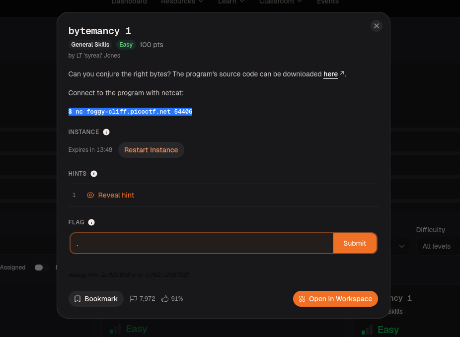
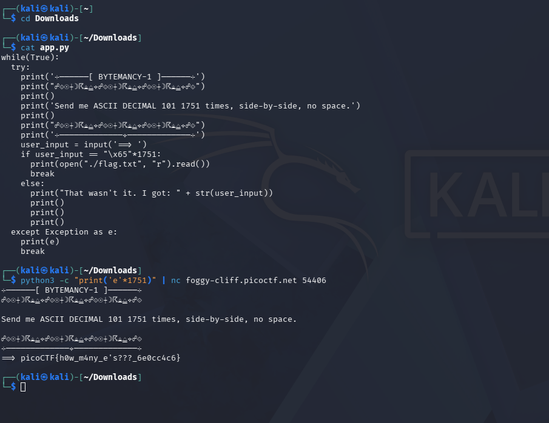

# Bytemancy 1 — picoCTF Writeup

## Description

> Can you conjure the right bytes? The program's source code can be downloaded [here].
>
> Connect to the program with netcat:
> `$ nc foggy-cliff.picoctf.net 54406`



---

## Solution

### Step 1 — Read the source code

Downloaded `app.py` and inspected the logic:

```python
while(True):
    try:
        print('--------[ BYTEMANCY-1 ]-------')
        print('Send me ASCII DECIMAL 101 1751 times, side-by-side, no space.')
        user_input = input('==> ')
        if user_input == "\x65" * 1751:
            print(open("./flag.txt", "r").read())
            break
        else:
            print("That wasn't it. I got: " + str(user_input))
    except Exception as e:
        print(e)
        break
```

The condition is:
- `\x65` in hex = decimal `101` = ASCII character **`e`**
- The input must be `e` repeated exactly **1751 times**, no spaces, no newline tricks

### Step 2 — Craft and pipe the payload

```bash
python3 -c "print('e'*1751)" | nc foggy-cliff.picoctf.net 54406
```

Python generates the exact 1751-character string and pipes it directly into netcat as input.

### Step 3 — Receive the flag

```
==> picoCTF{h0w_m4ny_e's???_6e0cc4c6}
```



---

## Flag

```
picoCTF{h0w_m4ny_e's???_6e0cc4c6}
```

---

## Key Concepts

| Concept | Detail |
|---|---|
| ASCII table | Decimal `101` = hex `\x65` = character `e` |
| Python one-liner | `python3 -c "print('e'*1751)"` generates the exact payload |
| Pipe `\|` | Sends Python stdout directly as netcat stdin |
| Source code analysis | Always read the source before connecting — the condition is right there |
