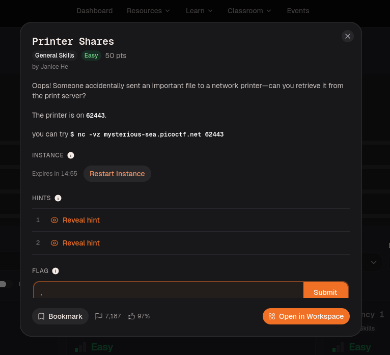
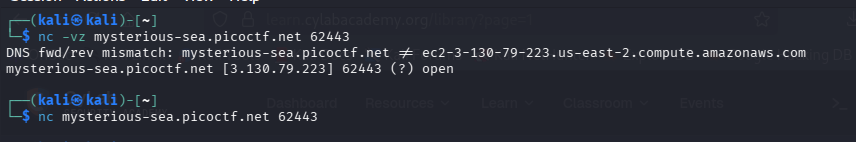
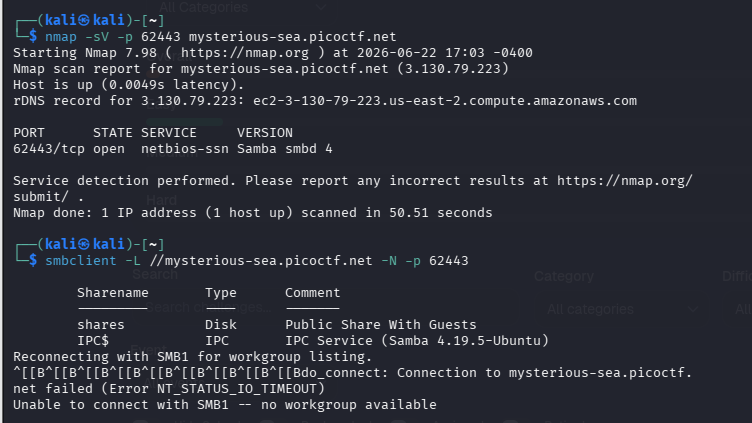
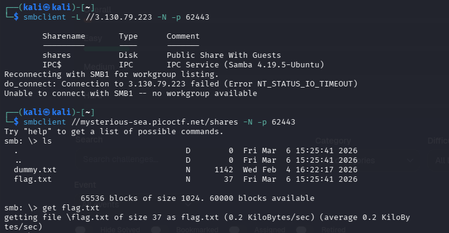
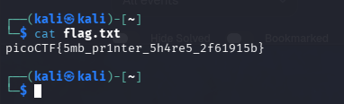
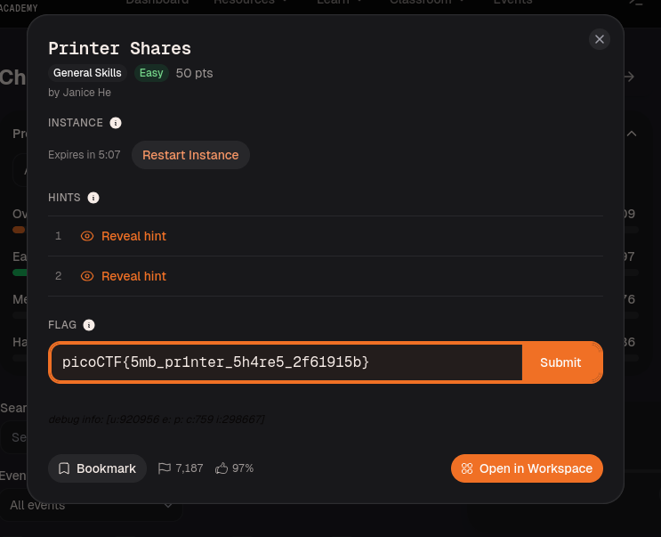

# Printer Shares — picoCTF Writeup
---

## Description

> Oops! Someone accidentally sent an important file to a network printer — can you retrieve it from the print server?
>
> The printer is on **62443**.
> You can try: `$ nc -vz mysterious-sea.picoctf.net 62443`



---

## Solution

### Step 1 — Confirm the port is open

```bash
nc -vz mysterious-sea.picoctf.net 62443
```

The verbose output confirms the port is open and resolves to an AWS EC2 instance. Then connect without the `-z` flag to interact:

```bash
nc mysterious-sea.picoctf.net 62443
```



---

### Step 2 — Identify the service with Nmap

```bash
nmap -sV -p 62443 mysterious-sea.picoctf.net
```

```
PORT      STATE SERVICE     VERSION
62443/tcp open  netbios-ssn Samba smbd 4
```

The service is **SMB (Samba)** — a network file sharing protocol. We can now use `smbclient` to list and access shares.

Then list available shares:

```bash
smbclient -L //mysterious-sea.picoctf.net -N -p 62443
```

```
Sharename   Type    Comment
---------   ----    -------
shares      Disk    Public Share With Guests
IPC$        IPC     IPC Service (Samba 4.19.5-Ubuntu)
```

Found a public share called `shares` with **guest access — no password needed**.



---

### Step 3 — Connect using the IP directly and browse the share

```bash
smbclient -L //3.130.79.223 -N -p 62443
smbclient //mysterious-sea.picoctf.net/shares -N -p 62443
```

```
smb: \> ls
  dummy.txt    N    1142    Wed Feb  4 16:22:17 2026
  flag.txt     N      37   Fri Mar  6 15:25:41 2026

smb: \> get flag.txt
```

Two files are present: `dummy.txt` and `flag.txt`. Downloaded `flag.txt`.



---

### Step 4 — Read the flag

```bash
cat flag.txt
```

```
picoCTF{5mb_pr1nter_5h4re5_2f61915b}
```



---

### Step 5 — Submit



---

## Flag

```
picoCTF{5mb_pr1nter_5h4re5_2f61915b}
```

---

## Key Concepts

| Concept | Detail |
|---|---|
| SMB Protocol | Server Message Block — used for Windows/Linux network file sharing |
| `nmap -sV` | Service version detection |
| `smbclient -L` | List shares on an SMB server |
| `-N` flag | No-password / anonymous guest access |
| `netbios-ssn` | Port service name indicating SMB traffic |
| `get <file>` | Download a file from an SMB share |
